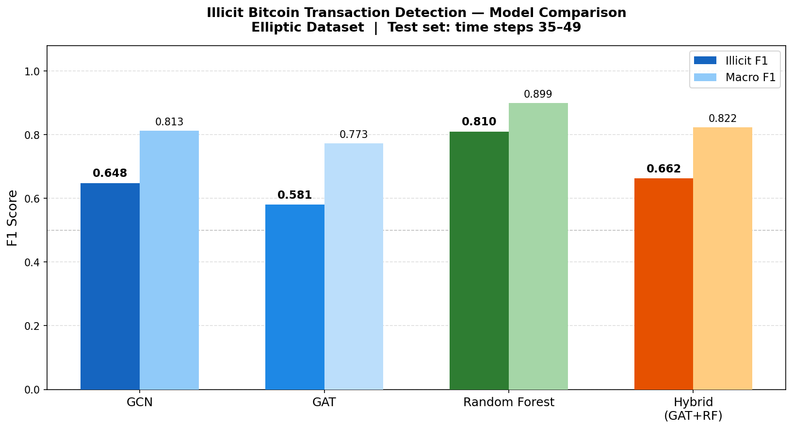
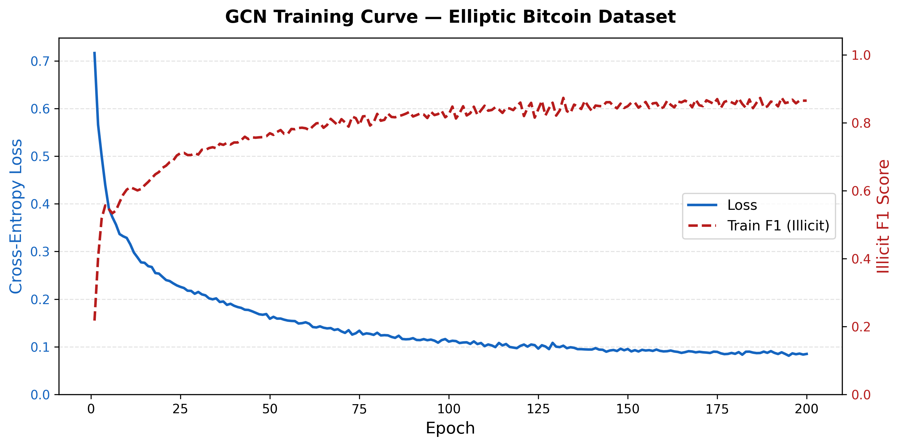
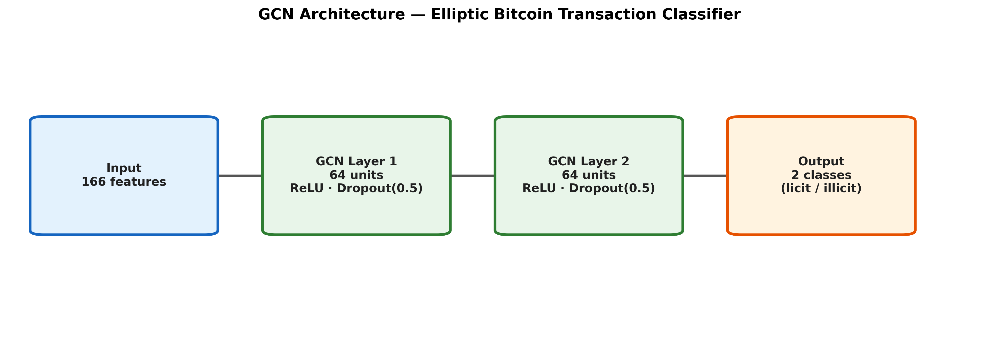
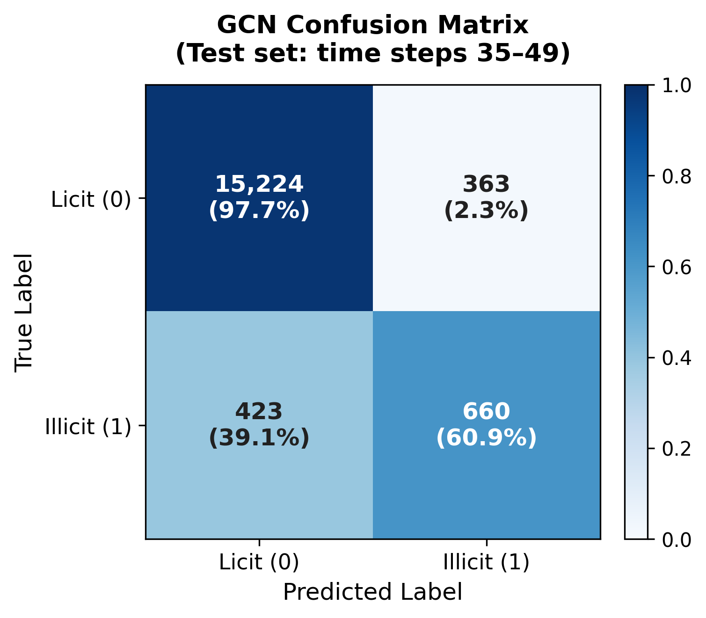
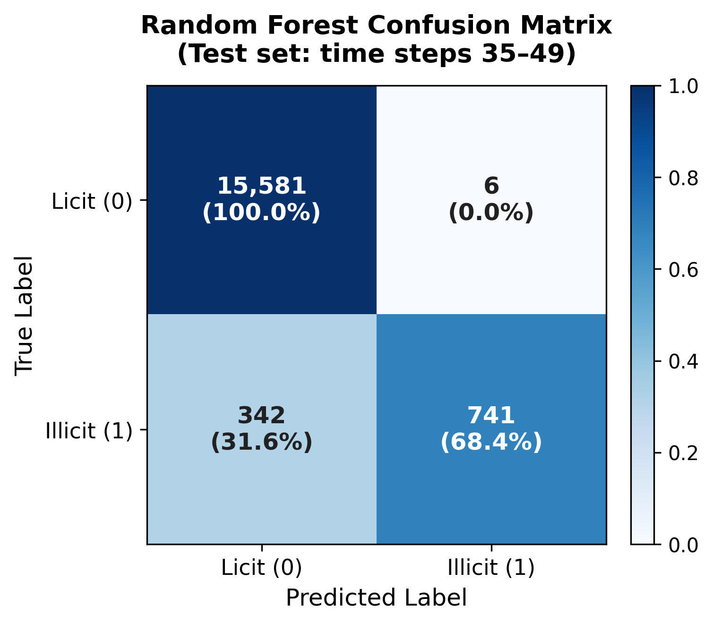
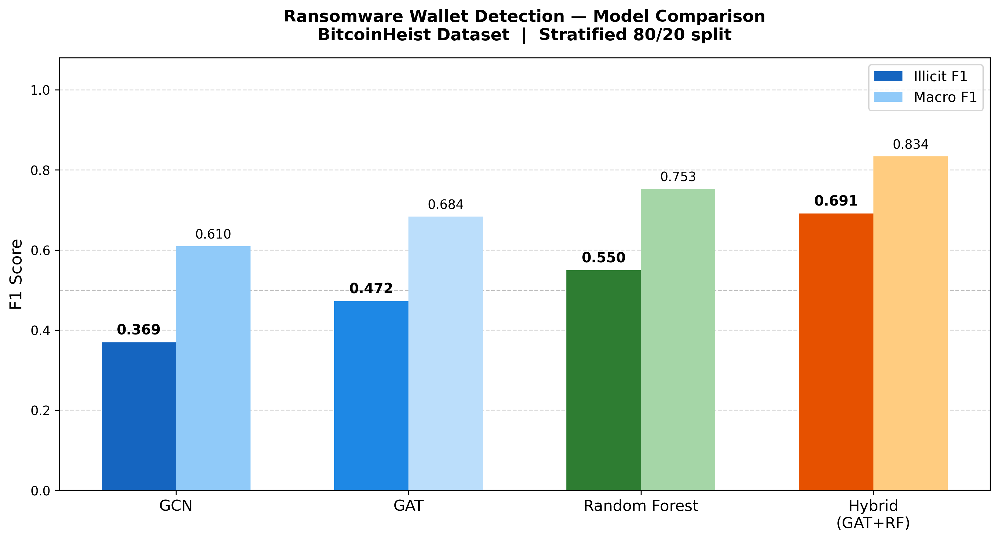
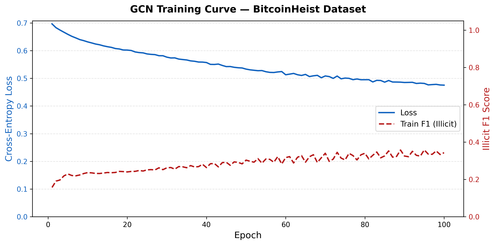
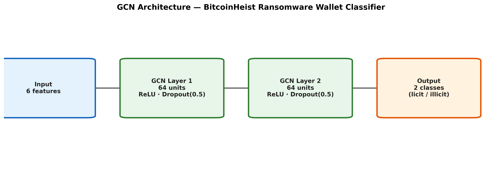
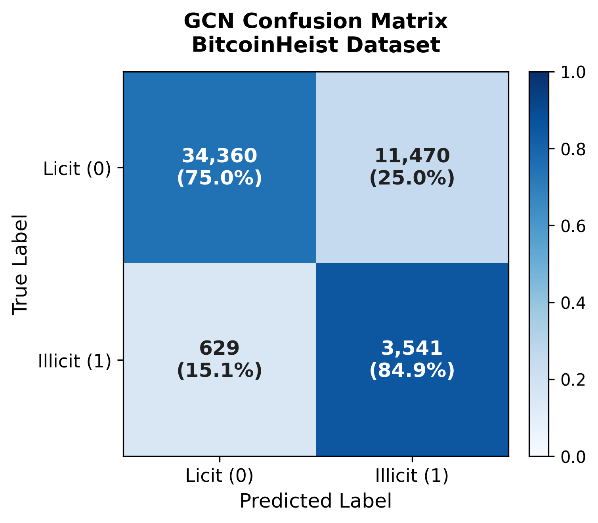
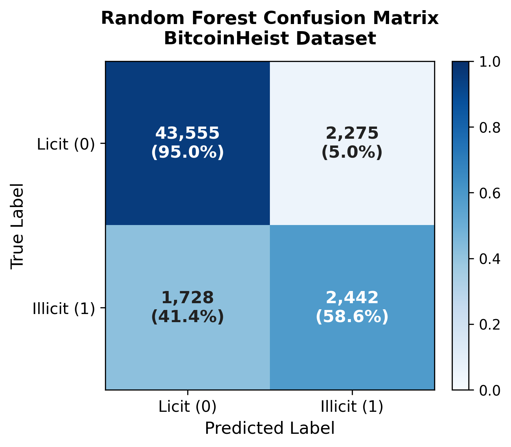

# Illicit Bitcoin Transaction Detection with Graph Neural Networks

Comparing GCN, GAT, Random Forest, and a Hybrid (GAT + RF) model for detecting money laundering and ransomware wallets in the Bitcoin transaction graph. Evaluated on two public datasets: **Elliptic** and **BitcoinHeist**.

---

## Datasets

Both datasets must be downloaded separately and placed in the project root before running.

| Dataset | What it contains | Download |
|---|---|---|
| Elliptic | 200K+ Bitcoin transactions labeled as licit/illicit across 49 time steps | [Kaggle — Elliptic Bitcoin Dataset](https://www.kaggle.com/datasets/ellipticco/elliptic-data-set) |
| BitcoinHeist | 2.9M Bitcoin wallet addresses labeled by ransomware family or `white` (licit) | [UCI ML Repository — BitcoinHeistRansomwareAddressDataset](https://archive.ics.uci.edu/dataset/526/bitcoinheist+ransomware+address+dataset) |

**Elliptic** — place these three files in the project root:
```
elliptic_txs_features.csv
elliptic_txs_edgelist.csv
elliptic_txs_classes.csv
```

**BitcoinHeist** — place this file in the project root:
```
BitcoinHeistData.csv
```

---

## Setup

Python 3.9+ recommended.

```bash
pip install torch torch-geometric scikit-learn pandas numpy matplotlib
```

If `torch-geometric` fails:
```bash
pip install torch-geometric --find-links https://data.pyg.org/whl/torch-2.10.0+cpu.html
```

---

## Running

Each dataset has its own self-contained script. Models are cached after the first run — subsequent runs skip training entirely and go straight to evaluation and charts.

```bash
# Elliptic pipeline
python elliptic_gnn_pipeline.py

# BitcoinHeist pipeline
python bitcoinheist_pipeline.py
```

Both scripts save all output charts as 300 DPI PNGs in the project folder.

---

## Results

### Elliptic Dataset

| Model | Illicit F1 | Macro F1 |
|---|---|---|
| GCN | — | — |
| GAT | — | — |
| Random Forest | — | — |
| Hybrid (GAT + RF) | — | — |

<p float="left">
  
</p>

<p float="left">
  
  
</p>

<p float="left">
  
  
</p>

---

### BitcoinHeist Dataset

| Model | Illicit F1 | Macro F1 |
|---|---|---|
| GCN | — | — |
| GAT | — | — |
| Random Forest | — | — |
| Hybrid (GAT + RF) | — | — |

<p float="left">
  
</p>

<p float="left">
  
  
</p>

<p float="left">
  
  
</p>

---

## Repository Structure

```
├── elliptic_gnn_pipeline.py          # Elliptic training + evaluation + charts
├── bitcoinheist_pipeline.py          # BitcoinHeist training + evaluation + charts
│
├── gcn_model.pth                     # Cached Elliptic GCN weights
├── gat_model.pth                     # Cached Elliptic GAT weights
├── gcn_stats.json                    # Elliptic GCN training history
├── gat_stats.json                    # Elliptic GAT training history
│
├── bh_gcn_model.pth                  # Cached BitcoinHeist GCN weights
├── bh_gat_model.pth                  # Cached BitcoinHeist GAT weights
├── bh_gcn_stats.json                 # BitcoinHeist GCN training history
├── bh_gat_stats.json                 # BitcoinHeist GAT training history
│
├── poster_results.png                # Elliptic model comparison chart
├── gcn_learning_curve.png
├── gcn_architecture.png
├── gcn_confusion_matrix.png
├── rf_confusion_matrix.png
│
├── bitcoinheist_model_comparison.png # BitcoinHeist model comparison chart
├── bitcoinheist_gcn_learning_curve.png
├── bitcoinheist_gcn_architecture.png
├── bitcoinheist_gcn_confusion_matrix.png
└── bitcoinheist_rf_confusion_matrix.png
```

> The raw CSV data files are not committed — download them from the links above.

---

## Author

Derrick Keith Jr.
